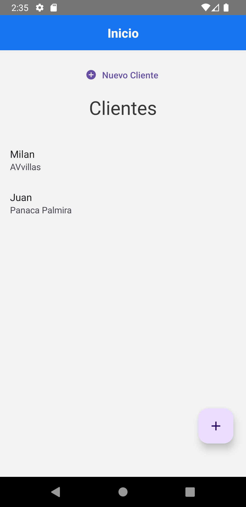
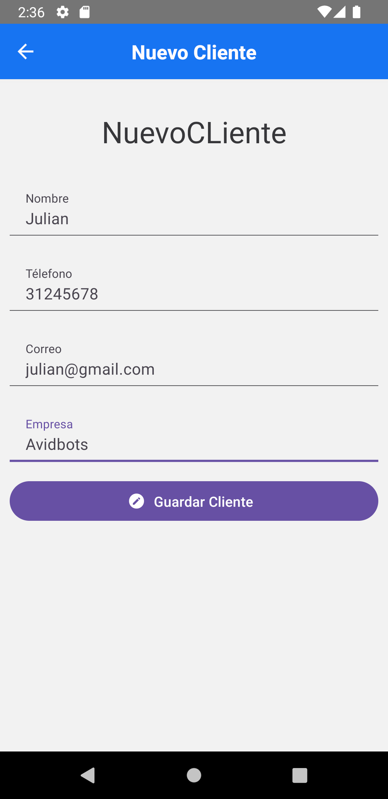
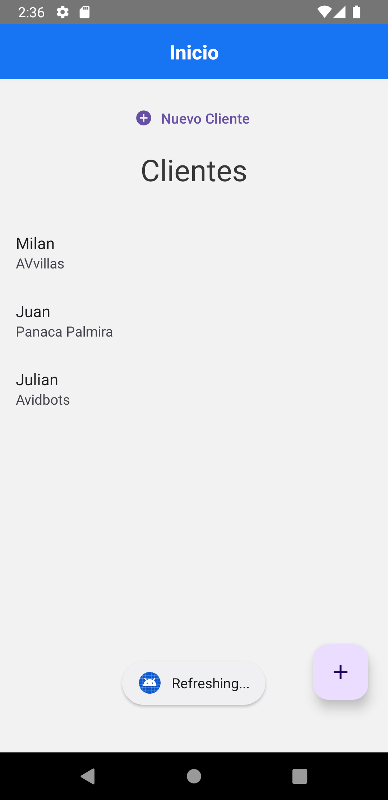
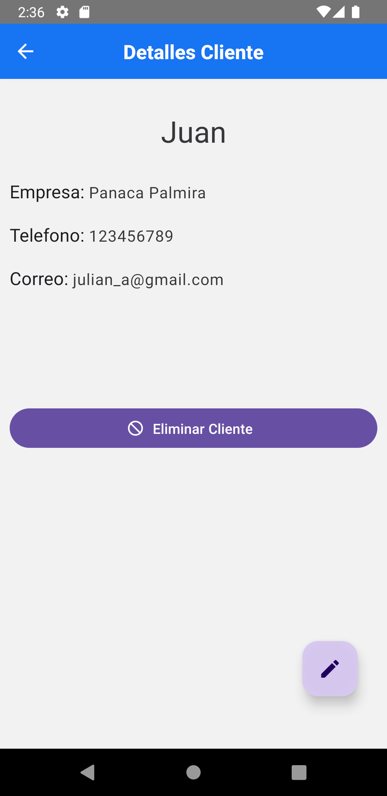
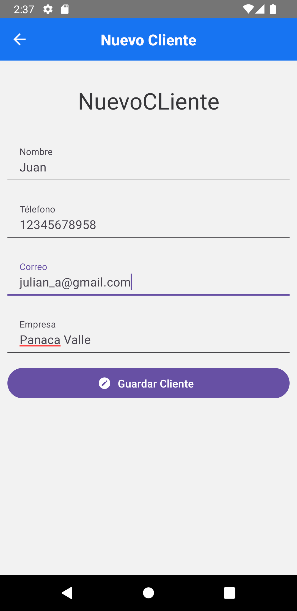
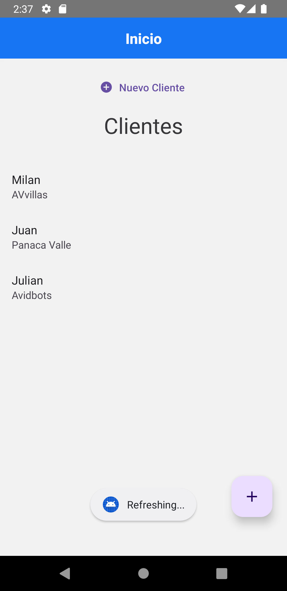
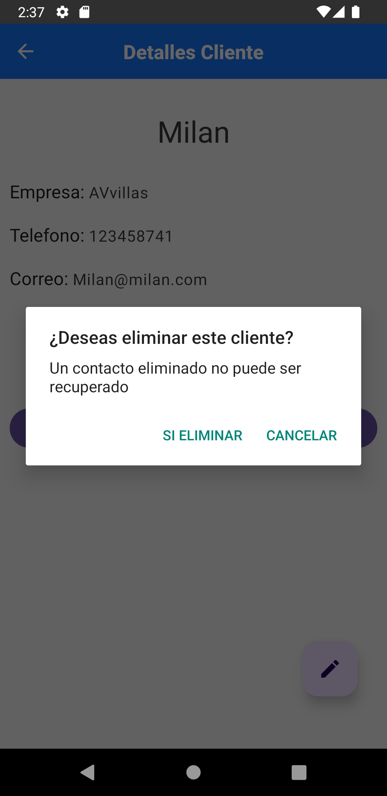

# Cients Administrator Emulated API
App to create, edit and eliminate clients using Json-server API emulator
This APP works with Json-server and lets the user administrate clients with the emulated API Json-server

# Libraries

This project has the next libraryes:

1. react-navigation/native
2. react-navigation/stack
3. axios
4. json-server

***Don't forget to install all the libraries and dependencies to run the project***

# Images

 &nbsp;&nbsp;&nbsp;&nbsp;
 &nbsp;&nbsp;&nbsp;&nbsp;
 &nbsp;&nbsp;&nbsp;&nbsp;

&emsp;&emsp;&emsp;&emsp;&emsp;&emsp;&emsp;&emsp;&emsp;&emsp;&emsp;&emsp;&emsp;&emsp;&emsp; 
 &nbsp;&nbsp;&nbsp;&nbsp; 

 &nbsp;&nbsp;&nbsp;&nbsp;
 &nbsp;&nbsp;&nbsp;&nbsp;
 &nbsp;&nbsp;&nbsp;&nbsp; 

&emsp;&emsp;&emsp;&emsp;&emsp;&emsp;&emsp;&emsp;&emsp;&emsp;&emsp;&emsp;&emsp;&emsp;&emsp;
 &nbsp;&nbsp;&nbsp;&nbsp;

 &nbsp;&nbsp;&nbsp;&nbsp;
 &nbsp;&nbsp;&nbsp;&nbsp; 

&emsp;&emsp;&emsp;&emsp;&emsp;&emsp;&emsp;&emsp;&emsp;&emsp;&emsp;&emsp;&emsp;&emsp;&emsp;
 &nbsp;&nbsp;&nbsp;&nbsp;

  
# Notes

Inside the "view" folder are located some .js archives with a variable called URL, 
if you run android is necessary to change the IP value with your IPV4 value to run the Jason-server. 
Also, the command to run the Json-server must have run ***npx json-server db.json -H "your IPV4 IP"**-* 

For Ios users, it is just necessary to run ***json-server db.json*** for the Json-server to start

